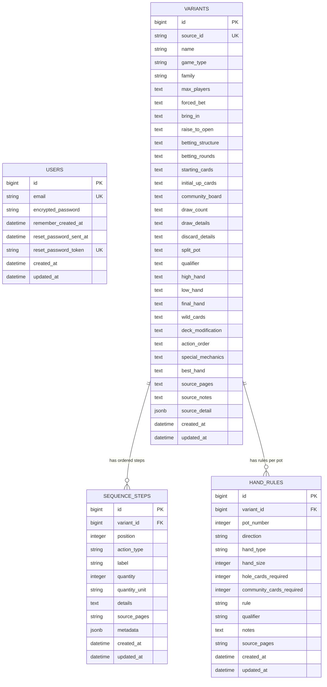

# The Mix — entity relationship diagram

`USERS` is retained from the starter Devise setup. The library itself is currently shared and does not associate variants with users.

`VARIANTS` stores the spreadsheet’s 27 editable fields. `SEQUENCE_STEPS` is an ordered, flexible child collection for deal, betting, draw, discard, separate, and special actions. `HAND_RULES` stores one or more hand-construction rules for each pot; games without a restriction can use the default “best five cards” behavior.
